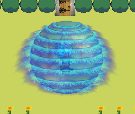

# Shinobi World

This project has been conducted as part of the course "INFO-H2001 - Oriented-object programmation" at the Ecole Polytechnique de Bruxelles - ULB, given from September 2018 and July 2019. The contributors are Victor Loir and Franck Trouillez. Everything has been done from scratch.

## How to play

Compile and run the main class

```bash
javac -d bin $(find -name "*.java" || dir /s /B *.java) && java -cp bin Main
```

or more convieniently, run:

```bash
./run
```

You can then play using your keyboard after launching a new game:


Don't forget to turn your sound on!

## Description

The game is basically a SIMS-like game, where you have different characters in different "families" that can move, interact, and evolve. Each character also need to eat, drink, and go to the toilet to survive. The game is real-time.


The theme of the game is as you could have guessed, the manga universe. The characters are Goku, Vegeta, Naruto, Sasuke, Charizard and Pikachu.

You can go fight enemies by going into the surrounding areas. Press the spacebar to interact, and the arrow keys to move. You can also interact with the doors to go to other areas.

You will start playing with Goku, and you can switch between characters by pressing the "A" key. Each character is basically the same.

Now, let's dive into the interesting features of the game

### Evolution system

To evolve, a system of experience is implemented.

Each character has a level, and can gain experience by beating enemies. When a character reaches a certain level, it can evolve into a new character. There are 3 stages to each evolution, and each stage has its own characteristics.

<p style="display: flex; justify-content: center; column-gap: 10px;" >
  
  
  
</p>

At the first level, you can only use the basic kick attack by pressing the "F" key.

<p style="display: flex; justify-content: center;" >
  
</p>

Once you reach the second level, you transform and you can now shoot fireballs by pressing "T".

<p style="display: flex; justify-content: center;" >
  
</p>

Finally, at the third level, you can use the super wave attack by pressing "R".

<p style="display: flex; justify-content: center;" >
  
</p>

You can gain experience by beating enemies. To do so, you need to go to the surrounding areas and fight the enemies.

Note: you can cheat and use the "X" button that gives you XP!

### Missions

You can also do missions to gain experience and gold. To do so, you need to find and talk to the mission givers and interact with them.

Normally, you have to find them in the surrounding areas, but we placed them in the hub to make it easier for you.

<p style="display: flex; justify-content: center;" >
  
</p>

Once you picked a mission, go to the right of the map and enter the mission area. You'll have to fight enemies to complete the mission.

I recommend you the last mission given by Beerus (the purple cat). You'll fight Orochimaru, and for Naruto fans, you'll hear a very familiar sound during the fight!
